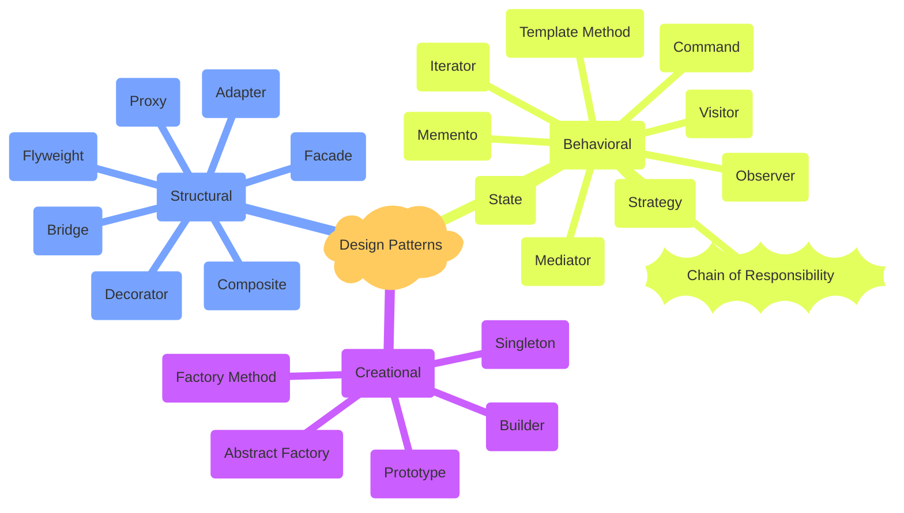

## Chain of Command Design Pattern

### Description

Definition: Chain of Responsibility is a behavioral design pattern that lets you pass requests along a chain of handlers. Upon receiving a request, each handler decides either to process the request or to pass it to the next handler in the chain.

### Implemented Example 

The main example ia a bit like in the diagram below, but here we're working with the following chain of events in order to log user to system:
* chcecking system (Server) resources availability
* user authentication
* user authorization roles check

___
